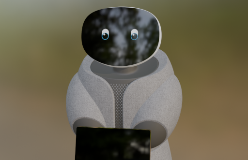

# 🤖 Garmi Description

[](https://github.com/geriatronics/garmi_description/actions/workflows/ci.yml)
[](LICENSE)

Welcome to the `garmi_description` repository! 🎉

This repository provides a lightweight, **portable** version of the Garmi robot model. It was carefully extracted from a much more complex full-stack simulation that includes many vendor-specific ROS 2 requirements and integrations.

The goal here is simple: to make it incredibly easy to share the Garmi robot model with partners, researchers, and developers! 🤝

## ✨ What makes this special?

- **Single URDF**: No more hunting through complex `xacro` macros or dealing with missing dependencies! Everything is compiled into a single, straightforward URDF file.
- **Self-Contained**: All meshes, materials, and textures are conveniently packed into this single package.
- **Simulation Agnostic**: While we provide basic ROS 2 examples, the model is perfect for experimenting across different simulation environments like **MuJoCo**, **Isaac Sim**, **PyBullet**, or whatever engine you prefer! 🚀

## 🛠️ Illustrative Examples

We've included a pre-configured ROS 2 Jazzy Docker setup so you can instantly see the robot model. 

> **Disclaimer:** The included visualization in RViz and the basic Gazebo simulation are really just for **illustration purposes** to show that the model works out-of-the-box. The real power is taking this URDF and using it in your own projects!

### Prerequisites

- [Docker](https://docs.docker.com/get-docker/)
- [Docker Compose](https://docs.docker.com/compose/install/)
- X11 Server (for running the GUI examples)

### Get the package

```bash
git clone https://github.com/geriatronics/garmi_description.git
cd garmi_description
```

### 👁️ View in RViz

Just want to see what Garmi looks like and check the joint limits?

```bash
docker compose up rviz
```

### 🎮 Basic Gazebo Simulation

The simulation is an empty world, but we've included GUIs to see all of the robot's Degrees of Freedom (DoF) in motion!

```bash
docker compose up gazebo
```

This opens a **single rqt window** with everything you need to drive the robot:
the joint-trajectory GUI to jog the arm/head/lift joints, plus a **joystick**
to drive the mecanum base by full holonomic twist (including **strafing**).

For an example where a node drives the robot through a simple periodic motion
instead of the GUIs, run:

```bash
docker compose up gazebo-motion
```

The motion is generated by [`scripts/demo_motion.py`](garmi_description/scripts/demo_motion.py) — a small starting point for your own controllers.

### 🧊 MuJoCo

A standalone [MuJoCo](https://mujoco.org/) version of the model lives in
[`garmi_description/mujoco/`](garmi_description/mujoco/) — no ROS required. It
includes the two FR3 arms, the lift, the head, and a free-floating
omnidirectional (mecanum) base. To open it in the interactive viewer:

```bash
docker compose up mujoco     # interactive viewer
docker compose up mujoco-teleop   # viewer + a twist joystick to drive the base
```

The model file [`mujoco/garmi.xml`](garmi_description/mujoco/garmi.xml) is
self-contained, so you can drop it straight into your own MuJoCo project. See
the [MuJoCo README](garmi_description/mujoco/README.md) for details.

## 📂 Structure Breakdown

- `Dockerfile` & `docker-compose.yml`: Quick-start containerized environment.
- `garmi_description/`
  - `urdf/`: The single, self-contained URDF file.
  - `meshes/`: Visual and collision geometries for the robot.
  - `launch/` & `config/`: Setup for the illustrative RViz and Gazebo tests.
  - `scripts/`: The `demo_motion.py` example controller node.
  - `mujoco/`: Standalone MuJoCo (MJCF) model, scene and assets.

## ⚠️ Caveats & Known Issues

Since this is a lightweight derivative, please keep the following in mind:
- **Kinematics Focused**: The model's primary focus right now is accurate kinematics and geometry. Dynamics properties (like precise masses or inertia) may not be fully accurate as system identification is still pending.
- **No Self-Collision**: Currently, self-collision is disabled/unavailable in the illustrative Gazebo simulation. This is related to an upstream issue ([gazebosim/gz-sim#3261](https://github.com/gazebosim/gz-sim/issues/3261)).
- **Effort Interfaces Disabled**: In the provided basic Gazebo setup, effort interfaces and gravity compensation for the arms have been deactivated as the controllers display instability in the current simulation engine.
- **Work in Progress**: A few details may be missing, but we will update this package as needed.

## 🙌 Credits & Acknowledgements

Garmi is developed at the **Technical University of Munich (TUM)**. The robot's
distinctive design — its head, neck, torso and covers — was created together
with **[Leap Leap](https://leap-leap.com/)**. A big thank you to them! 🎨

## 📄 License

This package is released under the **Apache License 2.0** — a permissive license
chosen specifically so that you can freely use, adapt, and build on Garmi in your
own research, experiments, and benchmarks. We'd love to see what you create! 🧪

A few of the bundled meshes come from third parties and keep their original
licenses (Apache-2.0 for Franka, BSD-3-Clause for the Clearpath-derived base).
Their notices are reproduced in the [`NOTICE`](NOTICE) and
[`THIRD_PARTY_LICENSES`](THIRD_PARTY_LICENSES) files — please keep them when you
redistribute. Everything else is © Technical University of Munich.

See the [`LICENSE`](LICENSE) file for the full text. Happy experimenting! 🚀
